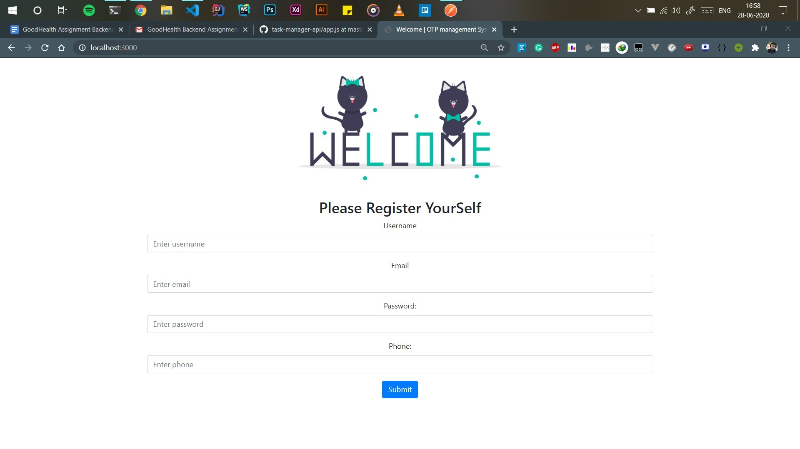

# OTP based login system

## Documentaion

## Dependencies used :muscle:
- [x] **NodeJs**  For Backend and server support
- [x] **ExpressJs**   To create server 
- [x] **NodeMailer**  To Send mails and OTP from the server
- [x] **MySQL**  To interact with MySQL database
- [x] **Crypto**  To Generate Hashed Passwords 
- [x] **Morgan**  For Server log support in case of failure

## Folder Structure

- [x] **Config :**  contains the database connectivity and configuration related files 
- [x] **Model :**  contains utilities related to db tables and passwords
- [x] **Public :**  contains stylesheets ans illustrations to be served from the server
- [x] **Routes :**  contains routing informations
- [x] **Views:**  contains templates to be served by server
- [x] **Public :**  contains stylesheets ans illustrations to be served from the server

## Endpoints of The API

### 1 . GET Requests
GET : localhost:3000/
```
This is the first page that is rendered when the user makes its first request to the server

```

