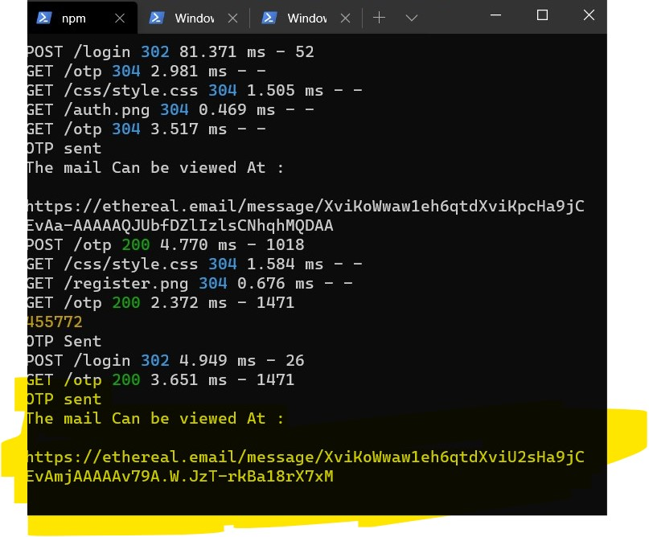
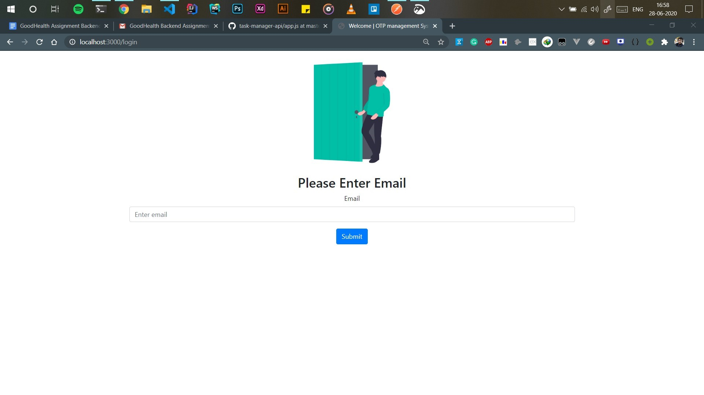
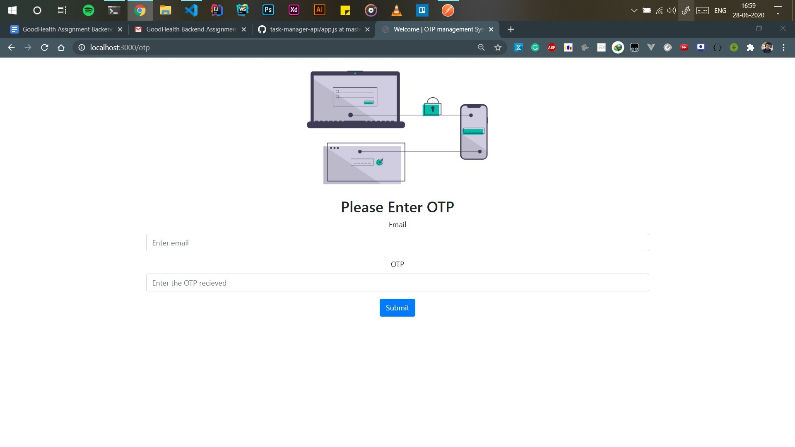
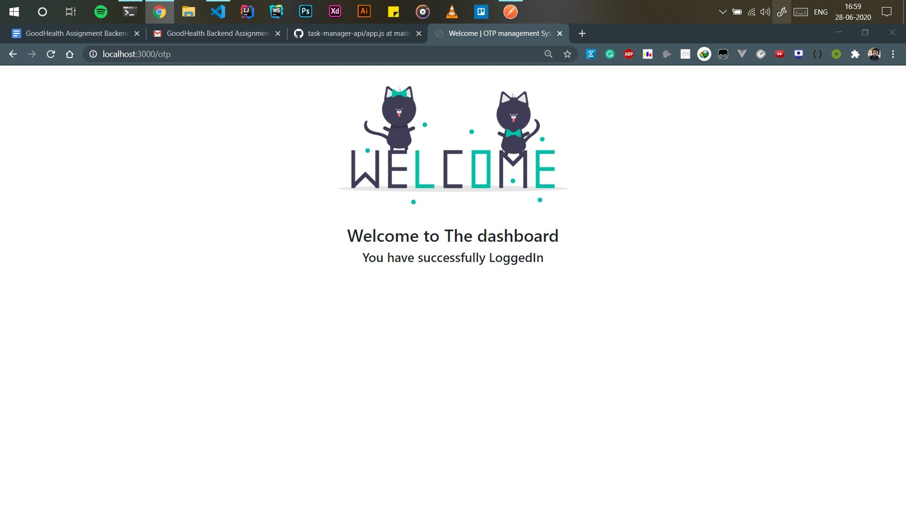

# OTP based login system

## Documentaion

## Dependencies used :muscle:
- [x] **NodeJs**  For Backend and server support
- [x] **ExpressJs**   To create server 
- [x] **NodeMailer**  To Send mails and OTP from the server
- [x] **MySQL**  To interact with MySQL database
- [x] **Crypto**  To Generate Hashed Passwords 
- [x] **Morgan**  For Server log support in case of failure

## Folder Structure

- [x] **Config :**  contains the database connectivity and configuration related files 
- [x] **Model :**  contains utilities related to db tables and passwords
- [x] **Public :**  contains stylesheets ans illustrations to be served from the server
- [x] **Routes :**  contains routing informations
- [x] **Views:**  contains templates to be served by server
- [x] **Public :**  contains stylesheets ans illustrations to be served from the server

## Setup :rocket:
In order to run the application make sure you have a database **users_db** created into mysql after creating the database please follow the steps <br>

0. Please clone this repository using git clone and cd into the directory
1. Inside .env file please **update your mysql username and password**
2. open terminal inside the directory and **npm install** to insatll all the dependencies
3. **npm start** to start the development server 
4. Cheers you've setup the project and the server is up and running

## Features of The API
1. User can register using the credentials and the password is encrypted before storing into the database
2. User can login using the email and a OTP is sent to the specified mail ( Here I am using nodemailers Test Account to send mails) however in production environment we can use API's like **SendGrid or MailGun**
3. OTP is sent and the otp can be viewed at by the address wriiten on the terminal 
4. User enters the OTP and the Dashboard is rendered indicating succesfull login
5. Server logs in case server crashes , that can be helpful to find the fault


**Example OTP Url**


## Endpoints of The API

### 1 . GET Requests
**GET: localhost:3000/**

```
This is the first page that is rendered when the user makes its first request to the server
```


**GET: localhost:3000/login**

```
This is the login page that is rendered when the user makes its request for login to the server
```



**GET: localhost:3000/otp**

```
This is the login page that is rendered when the user makes its request for entering the otp to the server
```


**Dashboard Page when User is Authenticated**

```
This is the dashboard page rendered by the server
```


### 1 . POST Requests
**POST: localhost:3000/register**
The body the register request contains the following
```
{
    "username" : "<Enter Your User name here>",
    "email" : "<Enter your mail here>",
    "password " : "<Enter your password here>",
    "phone" : "<Enter the phone number here>"
}
```